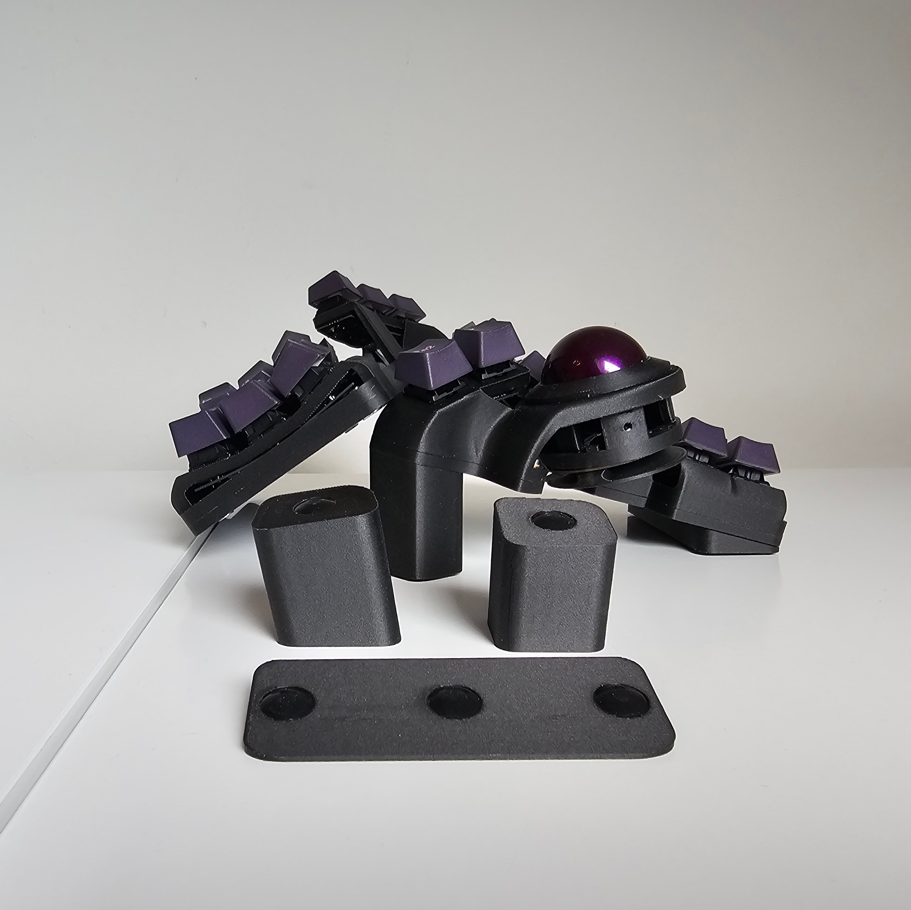

# Charybdis Magnetic Plates

In the mag you will find the left & right plates, the tents you can mirror in your slicer.
I used 10x3 magnets of Amazon that would be strong. They are rated for 2,3kg.

The magnets are embeded in the tents and you will need to add a pause in you slicer to add these.

